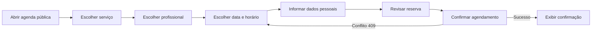
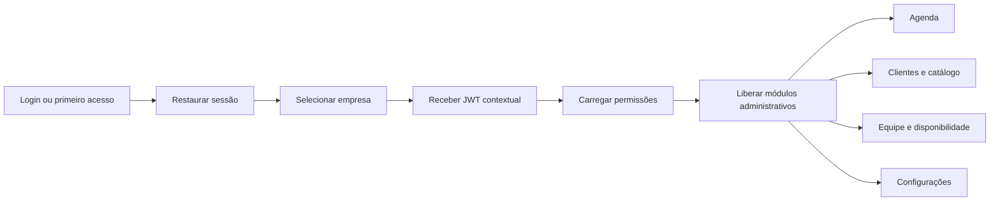
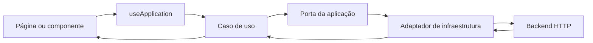

# Tirr Agenda — Front-end

Front-end web do **Tirr Agenda**, uma plataforma de agendamento para estabelecimentos que precisam publicar horários para clientes e administrar agenda, equipe, serviços, disponibilidade e acessos em um único lugar.

O projeto foi construído com React e TypeScript e segue uma arquitetura orientada a contextos de negócio. A interface não acessa o Axios ou endpoints diretamente: páginas e componentes invocam casos de uso, enquanto adaptadores de infraestrutura cuidam da comunicação com o backend.

## Sumário

- [O que o sistema resolve](#o-que-o-sistema-resolve)
- [Principais jornadas](#principais-jornadas)
- [Tecnologias](#tecnologias)
- [Como a aplicação funciona](#como-a-aplicação-funciona)
- [Arquitetura](#arquitetura)
- [Organização de pastas](#organização-de-pastas)
- [Padrão dos casos de uso](#padrão-dos-casos-de-uso)
- [Rotas](#rotas)
- [Autenticação e contexto da empresa](#autenticação-e-contexto-da-empresa)
- [Integração com a API](#integração-com-a-api)
- [Design system e acessibilidade](#design-system-e-acessibilidade)
- [Executando localmente](#executando-localmente)
- [Scripts](#scripts)
- [Testes e qualidade](#testes-e-qualidade)
- [Build e publicação](#build-e-publicação)
- [Convenções para desenvolvimento](#convenções-para-desenvolvimento)
- [Documentação complementar](#documentação-complementar)

## O que o sistema resolve

O Tirr Agenda atende dois públicos principais:

1. **Clientes do estabelecimento**, que usam uma jornada pública para escolher serviço, profissional, data e horário e concluir uma reserva.
2. **Usuários administrativos**, que entram em uma área autenticada e operam uma ou mais empresas conforme seus papéis e permissões.

### Recursos públicos

- Identificação do estabelecimento por ID ou slug.
- Listagem de serviços disponíveis.
- Seleção de profissional habilitado para o serviço.
- Consulta de datas e horários realmente disponíveis.
- Coleta dos dados do cliente.
- Revisão e confirmação do agendamento.
- Tratamento de conflito quando outro cliente reserva o mesmo horário.

### Recursos administrativos

- Agenda diária, semanal e mensal.
- Criação, reagendamento, cancelamento e alteração de status.
- Cadastro e manutenção de clientes.
- Catálogo de categorias e serviços.
- Cadastro de profissionais e vínculo com serviços.
- Regras semanais e exceções de disponibilidade.
- Perfil e expediente do estabelecimento.
- Gestão de membros, papéis e permissões.
- Criação, rotação e revogação de chaves de API.
- Alternância entre empresas vinculadas à mesma conta.

## Principais jornadas

### Agendamento público



O fluxo usa apenas os horários retornados pela API. Se a criação responder com conflito, a aplicação atualiza a disponibilidade e devolve o cliente à seleção de horário.

### Área administrativa



A empresa ativa faz parte da URL administrativa e do contexto de autorização. Trocar de empresa solicita um novo token contextual antes de carregar os dados do novo estabelecimento.

## Tecnologias

| Tecnologia | Responsabilidade |
| --- | --- |
| React 19 | Componentes e composição da interface |
| React Router 7 | Rotas públicas, autenticação e permissões |
| TypeScript 6 | Tipagem estática e contratos entre camadas |
| Vite 8 | Desenvolvimento, build e divisão de chunks |
| Zustand | Estado de autenticação, sessão e empresa ativa |
| Axios | Transporte HTTP nos adaptadores de infraestrutura |
| React Big Calendar | Agenda administrativa |
| Bootstrap 5 | Base de grid e controles |
| CSS próprio | Tokens, temas e componentes do design system |
| Vitest + jsdom | Testes unitários, arquiteturais e de apresentação |
| ESLint | Regras de qualidade e fronteiras arquiteturais |

## Como a aplicação funciona

O ponto de entrada é [`src/core.tsx`](src/core.tsx). Ele:

1. cria o grafo de dependências com `createApplication()`;
2. injeta o caso de uso de autenticação no store;
3. registra a renovação automática do token;
4. monta os providers de aplicação, tema e confirmação;
5. inicializa a sessão armazenada;
6. renderiza o roteamento.

O caminho de uma interação comum é:



Essa separação permite testar regras de negócio sem React ou Axios e impede que detalhes do backend contaminem os componentes.

## Arquitetura

O código é organizado por **contexto de negócio**, e cada contexto contém suas próprias camadas:

```text
src/architecture/
  administration/
    domain/
    application/
    infrastructure/
  scheduling/
    domain/
    application/
    infrastructure/
  identity/
    domain/
    application/
    infrastructure/
  shared/
    domain/
    http/
    result/
```

### Contextos

| Contexto | Responsabilidade |
| --- | --- |
| `administration` | Agenda interna, clientes, catálogo, profissionais, disponibilidade e dados da empresa |
| `scheduling` | Consulta pública de serviços, profissionais, disponibilidade e criação de reservas |
| `identity` | Login, sessão, perfil, empresas, membros, papéis, permissões e chaves de API |
| `shared` | Erros, resultado e infraestrutura HTTP realmente transversal |

### Camadas

#### Domain

Contém entidades, value objects, políticas e invariantes. Não depende de React, Axios ou infraestrutura.

Exemplos:

- validação de intervalos de horário;
- transições permitidas de um agendamento;
- garantia de que uma empresa continue com ao menos um proprietário;
- validação de preço, duração e dados obrigatórios.

#### Application

Contém DTOs, portas e casos de uso. Coordena regras e define contratos de entrada e saída sem conhecer o transporte HTTP.

#### Infrastructure

Implementa as portas da aplicação. Aqui ficam Axios, rotas do backend, normalização de respostas externas e armazenamento da sessão no navegador.

#### Presentation

Contém React, rotas, páginas, componentes, providers, hooks, store, ícones e estilos. A apresentação recebe casos de uso pelo `ApplicationProvider`.

#### Composition root

[`src/core/createApplication.ts`](src/core/createApplication.ts) instancia gateways, repositórios e casos de uso. [`src/core/applicationDependencies.ts`](src/core/applicationDependencies.ts) define o catálogo que pode ser consumido pela apresentação.

## Organização de pastas

```text
.
├── __api__/                         # massa auxiliar para JSON Server
├── docs/                            # arquitetura, API, design system e JSDoc
├── src/
│   ├── architecture/
│   │   ├── administration/
│   │   ├── identity/
│   │   ├── scheduling/
│   │   └── shared/
│   ├── core/
│   │   ├── applicationDependencies.ts
│   │   └── createApplication.ts
│   ├── presentation/
│   │   ├── app/                     # roteamento, sessão e error boundary
│   │   ├── components/              # componentes reutilizáveis
│   │   ├── hooks/                   # integração React com casos de uso
│   │   ├── icons/                   # biblioteca SVG local e tipada
│   │   ├── pages/
│   │   │   ├── administrator/
│   │   │   └── scheduler/
│   │   ├── providers/               # aplicação, tema e confirmações
│   │   ├── stores/                  # sessão e empresa ativa
│   │   ├── styles/                  # foundations, temas e componentes
│   │   └── utils/                   # formatação exclusiva da UI
│   └── core.tsx                     # entrada da aplicação
├── eslint.config.js
├── tsconfig.app.json
├── vite.config.ts
└── package.json
```

Não existe uma camada de compatibilidade com a arquitetura anterior. O código ativo está centralizado em `architecture`, `core` e `presentation`.

## Padrão dos casos de uso

Cada caso de uso possui uma pasta própria e três arquivos:

```text
CreatePublicBooking/
  CreatePublicBookingCommand.ts
  CreatePublicBookingUseCase.ts
  CreatePublicBookingResult.ts
```

- `Command`: contrato necessário para invocar o fluxo.
- `UseCase`: coordenação e regras da operação.
- `Result`: contrato devolvido ao consumidor.

Uso na apresentação:

```ts
const application = useApplication();

const result = await application.booking.createPublicBooking.execute({
  businessId,
  serviceId,
  professionalId,
  startsAtUtc,
  customerFullName,
  customerEmail,
  customerPhone,
});
```

Novas regras de negócio devem entrar em um caso de uso, e não diretamente em páginas ou componentes.

## Rotas

### Públicas

| Rota | Descrição |
| --- | --- |
| `/login` | Login e criação do primeiro acesso |
| `/agendar/:businessId` | Agenda pública canônica do estabelecimento |
| `/agendar/empresa/:slug` | Resolve o slug e redireciona para a rota canônica |

### Administrativas

A base administrativa é `/administrador/:businessId`.

| Caminho | Permissão principal | Módulo |
| --- | --- | --- |
| índice | `appointments.get` | Agenda |
| `clientes` | `customers.get` | Clientes |
| `catalogo` | `services.get` | Serviços e categorias |
| `equipe` | `professionals.get` | Profissionais e acessos |
| `disponibilidade` | `availability_rules.get` | Regras e exceções |
| `configuracoes` | `business.get` | Empresa, conta e integrações |

As páginas administrativas usam lazy loading. Rotas sem permissão exibem um estado de acesso negado sem carregar a página protegida.

## Autenticação e contexto da empresa

O ciclo de autenticação é coordenado pelo `AuthenticationUseCase` e refletido no store Zustand.

### Armazenamento

- **Access token:** mantido em memória e aplicado pelo cliente HTTP autenticado.
- **Refresh token:** armazenado em `sessionStorage`.
- **Empresa ativa:** armazenada em `localStorage` para restauração do contexto.
- **Tema e navegação:** preferências persistidas em `localStorage`.

### Renovação automática

Ao receber `401`, o cliente autenticado:

1. marca a requisição para evitar repetição infinita;
2. executa uma única renovação compartilhada entre requisições concorrentes;
3. atualiza o token;
4. repete a requisição uma vez;
5. encerra a sessão caso a renovação falhe.

### Segurança da apresentação

- Rotas privadas exigem sessão autenticada.
- Sub-rotas validam permissões específicas.
- Chaves de API são administradas, mas nunca usadas como credencial do navegador.
- O segredo de uma chave nova ou rotacionada é exibido uma única vez.

## Integração com a API

O cliente usa, por padrão, a base relativa:

```text
/api/v1
```

Em desenvolvimento, o Vite encaminha `/api` para:

```text
http://localhost:5010
```

### Variáveis

| Variável | Padrão | Uso |
| --- | --- | --- |
| `VITE_API_BASE_URL` | `/api/v1` | Base utilizada pelo Axios no navegador |
| `VITE_API_PROXY_TARGET` | `http://localhost:5010` | Destino do proxy do servidor Vite |

Exemplo de `.env.local` para alterar a base usada no navegador:

```env
VITE_API_BASE_URL=/api/v1
```

O alvo do proxy é lido pelo processo que inicia o Vite. No PowerShell:

```powershell
$env:VITE_API_PROXY_TARGET="http://localhost:5010"
yarn dev
```

### Erros HTTP

Respostas Problem Details são convertidas em `ApiError`, preservando:

- mensagem normalizada;
- status HTTP;
- erros associados a campos.

Os adaptadores públicos validam dados não confiáveis antes de criar DTOs. Um conflito `409` na reserva pública é convertido em `BookingConflictError`.

### Datas e horários

- Agendamentos usam UTC em `startsAtUtc` e `endsAtUtc`.
- Regras recorrentes usam horários locais do estabelecimento.
- Exceções usam data local e intervalo opcional.
- O fuso horário pertence ao perfil da empresa.

## Design system e acessibilidade

O design system está dividido em:

| Arquivo | Responsabilidade |
| --- | --- |
| `foundations.css` | Tokens de cor, tipografia, espaçamento, raio, sombra e movimento |
| `modern.css` | Componentes, shells, login, agenda pública e responsividade |
| `themes.css` | Compatibilidade de temas nas telas existentes |
| `calendar.css` | Adaptação isolada do React Big Calendar |

Recursos implementados:

- temas claro e escuro;
- biblioteca local de ícones SVG tipados;
- foco visível consistente;
- alvos de toque de 44 px no mobile;
- drawers e diálogos com Escape, contenção e retorno de foco;
- confirmações acessíveis sem `window.confirm`;
- estados de loading, erro, vazio e sucesso;
- navegação lateral no desktop e inferior no mobile;
- suporte a `prefers-reduced-motion` e `prefers-color-scheme`.

## Executando localmente

### Pré-requisitos

- Node.js `^20.19.0` ou `>=22.12.0`.
- Yarn 1.x.
- Backend compatível com os contratos documentados em [`docs/api-coverage.md`](docs/api-coverage.md).

### 1. Instale as dependências

```bash
yarn install
```

### 2. Inicie o backend

Por padrão, o proxy espera o backend em:

```text
http://localhost:5010
```

### 3. Inicie o front-end

```bash
yarn dev
```

O Vite exibirá o endereço local no terminal, normalmente `http://localhost:5173`.

### JSON Server auxiliar

```bash
yarn api:start
```

O arquivo `__api__/db.json` oferece massa auxiliar, mas não substitui necessariamente todos os endpoints e regras do backend principal.

## Scripts

| Comando | Descrição |
| --- | --- |
| `yarn dev` | Inicia o servidor Vite com hot reload |
| `yarn build` | Executa TypeScript e gera o build em `dist` |
| `yarn preview` | Serve localmente o build de produção |
| `yarn lint` | Analisa todo o projeto com ESLint |
| `yarn test` | Inicia o Vitest |
| `yarn test:watch` | Executa testes em modo contínuo |
| `yarn test:run` | Executa toda a suíte uma vez |
| `yarn test:ui` | Abre a interface do Vitest |
| `yarn test:debug` | Inicia os testes com inspector |
| `yarn coverage` | Gera cobertura de testes |
| `yarn api:start` | Inicia o JSON Server auxiliar |

## Testes e qualidade

A suíte cobre:

- regras e políticas de domínio;
- casos de uso;
- adaptadores HTTP e validação de respostas;
- renovação e persistência da sessão;
- estrutura obrigatória de `Command`, `UseCase` e `Result`;
- fronteiras entre application, domain, infrastructure e presentation;
- componentes básicos e utilitários da interface;
- guardrails do design system;
- cobertura obrigatória de JSDoc.

Antes de entregar uma alteração, execute:

```bash
yarn lint
yarn test:run
yarn build
```

O ESLint também impede que:

- domain dependa de React, Axios, application ou infrastructure;
- application dependa de adapters ou presentation;
- presentation importe implementações de infraestrutura.

## Build e publicação

Gere o build otimizado:

```bash
yarn build
```

Os arquivos serão produzidos em `dist/`.

Para publicar corretamente:

- configure o servidor para devolver `index.html` nas rotas do SPA;
- disponibilize a API em `/api/v1` ou configure `VITE_API_BASE_URL` durante o build;
- use HTTPS em produção;
- não exponha refresh tokens, chaves de API ou segredos em variáveis `VITE_*`;
- configure cache longo para assets versionados e sem cache agressivo para `index.html`.

## Convenções para desenvolvimento

### Nova regra de negócio

1. Escolha o contexto correto.
2. Implemente a regra no domínio quando for uma invariante.
3. Crie `Command`, `UseCase` e `Result` dentro de `application/useCases`.
4. Defina ou reutilize uma porta de aplicação.
5. Implemente a porta em `infrastructure`.
6. Registre o caso de uso em `createApplication` e `ApplicationDependencies`.
7. Consuma o caso de uso por `useApplication`.
8. Adicione testes e JSDoc.

### Novo componente ou página

- mantenha lógica de negócio fora do JSX;
- reutilize os componentes e tokens existentes;
- trate loading, erro, vazio e sucesso;
- garanta navegação por teclado e nomes acessíveis;
- proteja rotas e ações com as permissões adequadas;
- não importe Axios ou gateways na apresentação.

### JSDoc

Todo módulo TypeScript de produção e toda declaração nomeada exportada devem possuir JSDoc. O teste `documentation.test.ts` verifica essa convenção automaticamente.

### Aliases

| Alias | Destino |
| --- | --- |
| `@/administration` | `src/architecture/administration` |
| `@/scheduling` | `src/architecture/scheduling` |
| `@/identity` | `src/architecture/identity` |
| `@/shared-architecture` | `src/architecture/shared` |
| `@/presentation` | `src/presentation` |
| `@/core` | `src/core` |
| `@` | `src` |

## Documentação complementar

- [Arquitetura](docs/architecture.md)
- [Cobertura da API](docs/api-coverage.md)
- [Padrão JSDoc](docs/jsdoc.md)
- [Fundamentos do design system](docs/design-system/foundations.md)
- [Cores](docs/design-system/colors.md)
- [Tipografia](docs/design-system/typography.md)
- [Espaçamento](docs/design-system/spacing.md)
- [Componentes](docs/design-system/components.md)
- [Padrões de interface](docs/design-system/patterns.md)
- [Acessibilidade](docs/design-system/accessibility.md)

## Estado arquitetural

- A arquitetura anterior foi removida.
- A interface ativa está integralmente em `src/presentation`.
- Casos de uso ficam dentro de `application` e seguem o padrão por pasta.
- O composition root é o único local que conhece casos de uso e adaptadores simultaneamente.
- A comunicação com o backend acontece exclusivamente por portas e adaptadores dos contextos.
